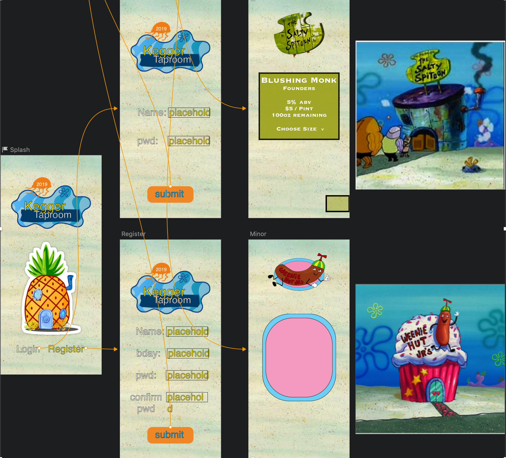

# SpongeBob Kegger

1. [Description](#description)
1. [Goals](#Goals)
1. [Planning Mock-ups](#Planning)
1. [Notes](#notes)
1. [Installation](#Installation)
1. [License](#license)

### Description
This is my most recent project! I have created an original design inspired by the Weenie Hut and Salty Spittoon from everyone's favorite Nickelodeon&trade; show, *SpongeBob SquarePants*. I have previously started this project in Angular and am excited to improve upon those ideas once again using React. So far, React has taken a little longer than Angular out the gate(I am not using Create React App), and the components definitely feel more scattered. However, I'm loving the flexibility and ease of integration with other resources.

### Goals

 __Tasks :__

         - [x] A completed task
         - [ ] An uncompleted task

 __MVP :__

         - [x] Logo
         - [x] Splash Page
         - [x] Grid System
         - [x] Flex inside Grid
         - [ ] Login Authentication
         - [x] Readme lookin' nice
         - [x] Routing
         - [x] Inital Styles
         - [x] State Management
         

 __Stretch Goals :__

         - [ ] DRY-est CODE
         - [x] React Hook
         - [ ] Svg animation with anime.js
         - [ ] Upload custom audio
         - [ ] PWA
         - [ ] Offline Service/Storage
         - [ ] Optimization

  __Optimization :__

         - [NA/100] Performance
         - [NA/100] Accessibility
         - [NA/100] Best Practices
         - [NA/100] SEO
         - [NA/100] Progressive Web App

### Planning

### Notes

* Weenie Shape divs in underage kombucha list
* Would love to change menu design to a crabby patty
  * Maybe add bubbles to the splash page on window click that float to the hamburger to direct user's to the menu
  * Could also create bubbles which emit from the burger for same reason^
* Change font-type in splashHeader
* Change arrow color

### Installation

1. Clone or download this repository as zip
2. `npm i` in terminal
3. `npm run start`
4. Visit http://localhost:8080/ in browser

### License
